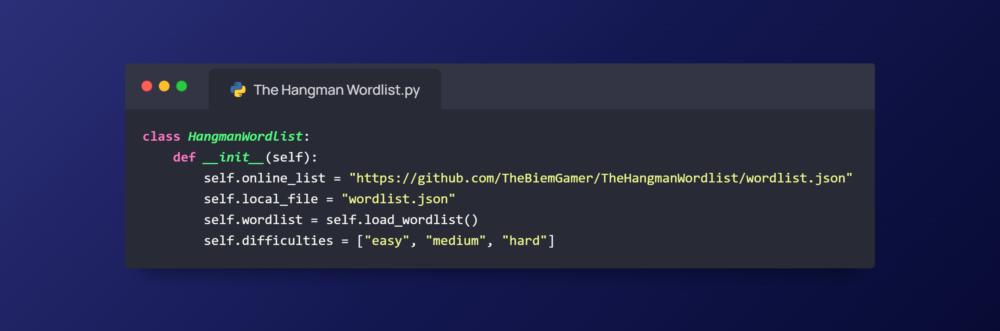

# The Hangman Wordlist

A simple Python library with a wordlist for use with hangman featuring easy, medium and hard words!

### Usage
First install the package:
```bash
$ pip install the-hangman-wordlist
```
or
```bash
$ pip3 install the-hangman-wordlist
```
Then you could use it like in this example code:
```py
from the_hangman_wordlist import HangmanWordlist

if __name__ == "__main__":
    wordlist = HangmanWordlist()
    difficulty = input("What difficulty do you want? (easy/medium/hard): ")
    word, version = wordlist.pull_word(difficulty)
    print(f"\nThe {difficulty} word is: '{word}'")
    print(f"Wordlist v{version}")
    input("\nPress Enter to exit...")
```

### Functions
```py
def __init__():
    # Loads when HangmanWordlist is imported, sets the variables and loads the wordlist with the load_wordlist() function.
    
def fetch_online_wordlist():
    # Fetches the wordlist online and returns it as json.

def load_wordlist():
    # Checks if the user has a copy of the wordlist.json and if it's up to date and then downloads it if necessary with the save_wordlist() function.

def save_wordlist(wordlist):
    # Saves the passed wordlist to wordlist.json

def pull_word(difficulty):
    # Checks if the difficulty passed is a correct option if not it chooses a random difficulty and then it returns a random word from the chosen difficulty and the wordlist version.
```
Only the pull_world() function was made to be called by the user the different functions should be called automatically when the script is initialized.

### Credits
- [Jurriaaaantje](https://github.com/Jurriaaaantje) (Wordlist words and update wordlist functionality)
- [TheBiemGamer](https://github.com/TheBiemGamer) (Version check, json functionality and library)
